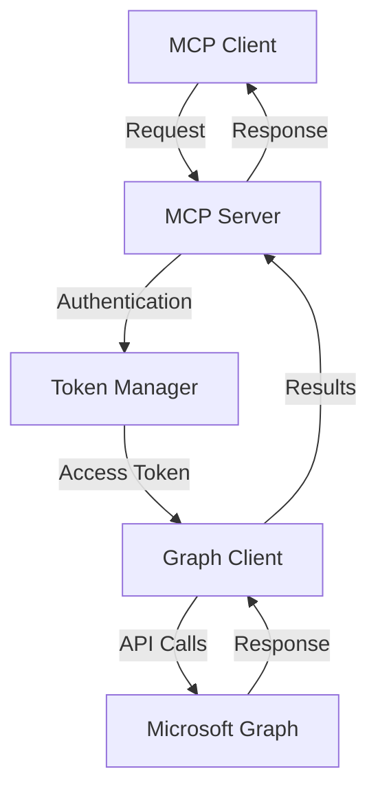

# CISA SharePoint & OneDrive MCP Server

A Model Context Protocol (MCP) server implementing CISA Binding Operational Directive 25-01 security controls for Microsoft SharePoint Online and OneDrive.

## Table of Contents

- [Overview](#overview)
- [Security Controls](#security-controls)
- [Architecture](#architecture)
- [Prerequisites](#prerequisites)
- [Installation](#installation)
- [Configuration](#configuration)
- [Usage](#usage)
- [API Reference](#api-reference)
- [Error Handling](#error-handling)
- [Testing](#testing)
- [Security Considerations](#security-considerations)
- [Contributing](#contributing)
- [License](#license)

## Overview

This MCP server provides tools for configuring and managing SharePoint Online and OneDrive security settings in accordance with BOD 25-01 requirements. It integrates with Microsoft Graph API to enforce security controls, monitor compliance, and provide detailed reporting.

### Key Features

- External sharing restrictions for SharePoint and OneDrive
- Default sharing scope and permission controls
- Custom script prevention on self-service sites
- Comprehensive compliance reporting
- Token-based authentication
- Type-safe argument validation
- Detailed error handling and logging

## Security Controls

### MS.SHAREPOINT.1.1v1
**Due Date: 06/20/2025**

Restricts external sharing in SharePoint to:
- Existing Guests only, or
- Only People in your Organization

Implementation details:
```typescript
await graphClient
  .api('/admin/sharepoint/settings')
  .patch({
    sharingCapability: args.sharingLevel,
    fileAnonymousLinkType: 'View',
    folderAnonymousLinkType: 'View',
    defaultSharingLinkType: 'Internal',
    requireAnonymousLinksExpireInDays: 7,
    sharingDomainRestrictionMode: 'AllowList',
  });
```

### MS.SHAREPOINT.1.2v1
**Due Date: 06/20/2025**

Restricts external sharing in OneDrive to:
- Existing Guests only, or
- Only People in your Organization

Implementation details:
```typescript
await graphClient
  .api('/admin/onedrive/settings')
  .patch({
    oneDriveSharingCapability: args.sharingLevel,
    fileAnonymousLinkType: 'View',
    folderAnonymousLinkType: 'View',
    defaultSharingLinkType: 'Internal',
    requireAnonymousLinksExpireInDays: 7,
    sharingDomainRestrictionMode: 'AllowList',
  });
```

### MS.SHAREPOINT.2.1v1
**Due Date: 06/20/2025**

Configures default sharing scope:
- Sets file and folder default sharing scope to "Specific People"
- Requires explicit selection of recipients
- Prevents accidental oversharing

Implementation details:
```typescript
await graphClient
  .api('/admin/sharepoint/settings')
  .patch({
    defaultSharingLinkScope: 'SpecificPeople',
    requireSignInToAccessSites: true,
  });

await graphClient
  .api('/admin/onedrive/settings')
  .patch({
    defaultSharingLinkScope: 'SpecificPeople',
    requireSignInToAccessFiles: true,
  });
```

### MS.SHAREPOINT.2.2v1
**Due Date: 06/20/2025**

Configures default sharing permissions:
- Sets file and folder default permissions to "View only"
- Restricts default access level
- Requires explicit permission elevation
- Implements principle of least privilege

Implementation details:
```typescript
await graphClient
  .api('/admin/sharepoint/settings')
  .patch({
    defaultLinkPermission: 'View',
    preventExternalUsersFromResharing: true,
    emailAttestationRequired: true,
    blockDownloadLinksFileType: 'WebPreviewableFiles',
  });
```

### MS.SHAREPOINT.4.2v1
**Due Date: 06/20/2025**

Prevents custom script execution:
- Disables custom scripts on self-service created sites
- Enhances security of user-created sites
- Maintains controlled development environment

Implementation details:
```typescript
await graphClient
  .api('/admin/sharepoint/settings')
  .patch({
    customScriptSites: 'Disabled',
    userCustomScriptSites: 'Disabled',
    legacyAuthProtocolsEnabled: false,
    showPeoplePickerSuggestionsForGuestUsers: false,
  });
```

## Architecture

### Components

1. **Server Class**
   - Handles MCP protocol implementation
   - Manages tool registration and execution
   - Implements error handling and logging

2. **Authentication**
   - Token-based authentication with Microsoft Graph API
   - Automatic token refresh
   - Secure credential management

3. **Graph Client**
   - Wrapper around Microsoft Graph API
   - Type-safe request/response handling
   - Retry logic and error handling

4. **Tools**
   - SharePoint sharing configuration
   - OneDrive sharing configuration
   - Default sharing scope management
   - Default permission management
   - Custom script control
   - Policy status reporting

### Data Flow



## Prerequisites

- Node.js 18.x or higher
- Microsoft 365 tenant with admin access
- Azure AD application with required permissions:
  - SharePoint.ReadWrite.All
  - Sites.ReadWrite.All
  - User.Read.All

## Installation

1. Clone the repository:
```bash
git clone https://github.com/DynamicEndpoints/BOD-25-01-CSA-MCP.git
cd cisa-sharepoint
```

2. Install dependencies:
```bash
npm install
```

3. Build the server:
```bash
npm run build
```

## Configuration

1. Create Azure AD application:
   - Navigate to Azure Portal > Azure Active Directory
   - Register a new application
   - Add required API permissions
   - Create a client secret

2. Configure environment variables:
```bash
cp .env.example .env
```

Edit `.env` file:
```env
TENANT_ID=your-tenant-id
CLIENT_ID=your-client-id
CLIENT_SECRET=your-client-secret
```

3. Configure MCP settings:

```json
{
  "mcpServers": {
    "cisa-sharepoint": {
      "command": "node",
      "args": ["path/to/cisa-sharepoint/build/index.js"],
      "env": {
        "TENANT_ID": "your-tenant-id",
        "CLIENT_ID": "your-client-id",
        "CLIENT_SECRET": "your-client-secret"
      }
    }
  }
}
```

## Usage

### Available Tools

#### configure_sharepoint_sharing
Configure SharePoint external sharing settings.

```json
{
  "sharingLevel": "ExistingGuests"
}
```

#### configure_onedrive_sharing
Configure OneDrive external sharing settings.

```json
{
  "sharingLevel": "OnlyOrganization"
}
```

#### configure_default_sharing_scope
Configure default sharing scope for files and folders.

```json
{}
```

#### configure_default_sharing_permissions
Configure default sharing permissions for files and folders.

```json
{}
```

#### disable_custom_scripts
Prevent users from running custom scripts on self-service created sites.

```json
{}
```

#### get_policy_status
Get current status of all CISA SharePoint and OneDrive security policies.

```json
{}
```

### Example Usage

```typescript
// Configure SharePoint sharing
const result = await client.callTool('configure_sharepoint_sharing', {
  sharingLevel: 'ExistingGuests'
});

// Get policy status
const status = await client.callTool('get_policy_status', {});
```

## API Reference

### SharePoint Settings API

```typescript
interface SharePointSettings {
  sharingCapability: 'ExistingGuests' | 'OnlyOrganization';
  fileAnonymousLinkType: 'View';
  folderAnonymousLinkType: 'View';
  defaultSharingLinkType: 'Internal';
  requireAnonymousLinksExpireInDays: number;
  sharingDomainRestrictionMode: 'AllowList';
}
```

### OneDrive Settings API

```typescript
interface OneDriveSettings {
  oneDriveSharingCapability: 'ExistingGuests' | 'OnlyOrganization';
  fileAnonymousLinkType: 'View';
  folderAnonymousLinkType: 'View';
  defaultSharingLinkType: 'Internal';
  requireAnonymousLinksExpireInDays: number;
  sharingDomainRestrictionMode: 'AllowList';
}
```

## Error Handling

The server implements comprehensive error handling:

1. **Authentication Errors**
   - Token acquisition failures
   - Permission issues
   - Tenant configuration problems

2. **API Errors**
   - Graph API request failures
   - Rate limiting
   - Service unavailability

3. **Validation Errors**
   - Invalid arguments
   - Missing required parameters
   - Type mismatches

4. **Runtime Errors**
   - Network issues
   - Timeout problems
   - Resource constraints

Example error response:
```json
{
  "error": {
    "code": "InvalidParams",
    "message": "Invalid SharePoint sharing arguments",
    "details": {
      "parameter": "sharingLevel",
      "allowed": ["ExistingGuests", "OnlyOrganization"],
      "received": "AllUsers"
    }
  }
}
```

## Testing

1. Run unit tests:
```bash
npm test
```

2. Run integration tests:
```bash
npm run test:integration
```

3. Run compliance tests:
```bash
npm run test:compliance
```

## Security Considerations

1. **Authentication**
   - Use secure token storage
   - Implement token rotation
   - Monitor for suspicious activity

2. **API Access**
   - Follow least privilege principle
   - Regular permission audits
   - Monitor API usage

3. **Data Protection**
   - No sensitive data logging
   - Secure configuration storage
   - Regular security scans

4. **Compliance**
   - Regular compliance checks
   - Automated policy verification
   - Audit logging

## Contributing

1. Fork the repository
2. Create a feature branch
3. Make your changes
4. Run tests
5. Submit a pull request

Guidelines:
- Follow existing code style
- Add tests for new features
- Update documentation
- Keep commits atomic

## License

MIT
