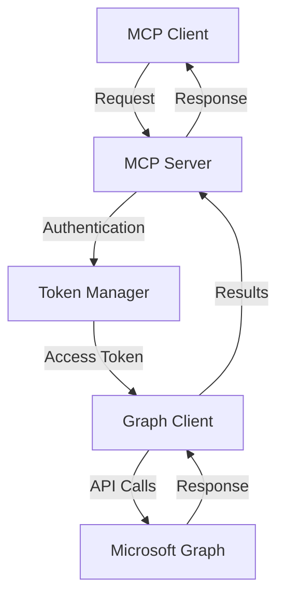

# CISA Teams MCP Server

A Model Context Protocol (MCP) server implementing CISA Binding Operational Directive 25-01 security controls for Microsoft Teams.

## Table of Contents

- [Overview](#overview)
- [Security Controls](#security-controls)
- [Architecture](#architecture)
- [Prerequisites](#prerequisites)
- [Installation](#installation)
- [Configuration](#configuration)
- [Usage](#usage)
- [API Reference](#api-reference)
- [Error Handling](#error-handling)
- [Testing](#testing)
- [Security Considerations](#security-considerations)
- [Contributing](#contributing)
- [License](#license)

## Overview

This MCP server provides tools for configuring and managing Microsoft Teams security settings in accordance with BOD 25-01 requirements. It integrates with Microsoft Graph API to enforce security controls, monitor compliance, and provide detailed reporting.

### Key Features

- Anonymous meeting restrictions
- External access domain controls
- Unmanaged user restrictions
- Skype federation controls
- Email integration management
- Comprehensive compliance reporting
- Token-based authentication
- Type-safe argument validation
- Detailed error handling and logging

## Security Controls

### MS.TEAMS.1.2v1
**Due Date: 06/20/2025**

Prevents anonymous users from starting meetings:
- Disables anonymous meeting initiation
- Enhances meeting security
- Ensures participant accountability

Implementation details:
```typescript
await graphClient
  .api('/policies/teamsAppSetupPolicies/global')
  .patch({
    allowAnonymousUsersToStartMeeting: false,
    allowAnonymousUsersToJoinMeeting: false,
  });
```

### MS.TEAMS.2.1v1
**Due Date: 06/20/2025**

Configures external access on per-domain basis:
- Restricts external access to specific domains
- Enables controlled collaboration
- Maintains organizational boundaries

Implementation details:
```typescript
await graphClient
  .api('/policies/teamsFederationSettings')
  .patch({
    allowedDomains: domains,
    allowFederatedUsers: true,
    allowTeamsConsumer: false,
    allowTeamsB2BUsers: true,
  });
```

### MS.TEAMS.2.2v1
**Due Date: 06/20/2025**

Prevents unmanaged users from initiating contact:
- Blocks unmanaged user chat initiation
- Restricts meeting creation by unmanaged users
- Enhances organizational control

Implementation details:
```typescript
await graphClient
  .api('/policies/teamsExternalUserSettings')
  .patch({
    allowUnmanagedUsersToCreateMeetings: false,
    allowUnmanagedUsersToStartChat: false,
  });
```

### MS.TEAMS.3.1v1
**Due Date: 06/20/2025**

Blocks contact with Skype users:
- Disables Skype federation
- Prevents Skype user communication
- Ensures communication channel control

Implementation details:
```typescript
await graphClient
  .api('/policies/teamsFederationSettings')
  .patch({
    allowSkypeUsers: false,
    allowSkypeFederation: false,
  });
```

### MS.TEAMS.4.1v1
**Due Date: 06/20/2025**

Disables Teams email integration:
- Prevents email channel creation
- Disables email integration features
- Reduces attack surface

Implementation details:
```typescript
await graphClient
  .api('/policies/teamsEmailSettings')
  .patch({
    allowEmailIntegration: false,
    allowChannelEmail: false,
  });
```

## Architecture

### Components

1. **Server Class**
   - Handles MCP protocol implementation
   - Manages tool registration and execution
   - Implements error handling and logging

2. **Authentication**
   - Token-based authentication with Microsoft Graph API
   - Automatic token refresh
   - Secure credential management

3. **Graph Client**
   - Wrapper around Microsoft Graph API
   - Type-safe request/response handling
   - Retry logic and error handling

4. **Tools**
   - Anonymous meeting control
   - External access management
   - Unmanaged user restrictions
   - Skype federation control
   - Email integration management
   - Policy status reporting

### Data Flow



## Prerequisites

- Node.js 18.x or higher
- Microsoft 365 tenant with admin access
- Azure AD application with required permissions:
  - TeamSettings.ReadWrite.All
  - Policy.ReadWrite.All
  - User.Read.All

## Installation

1. Clone the repository:
```bash
git clone https://github.com/DynamicEndpoints/BOD-25-01-CSA-MCP.git
cd cisa-teams
```

2. Install dependencies:
```bash
npm install
```

3. Build the server:
```bash
npm run build
```

## Configuration

1. Create Azure AD application:
   - Navigate to Azure Portal > Azure Active Directory
   - Register a new application
   - Add required API permissions
   - Create a client secret

2. Configure environment variables:
```bash
cp .env.example .env
```

Edit `.env` file:
```env
TENANT_ID=your-tenant-id
CLIENT_ID=your-client-id
CLIENT_SECRET=your-client-secret
```

3. Configure MCP settings:

```json
{
  "mcpServers": {
    "cisa-teams": {
      "command": "node",
      "args": ["path/to/cisa-teams/build/index.js"],
      "env": {
        "TENANT_ID": "your-tenant-id",
        "CLIENT_ID": "your-client-id",
        "CLIENT_SECRET": "your-client-secret"
      }
    }
  }
}
```

## Usage

### Available Tools

#### disable_anonymous_meetings
Disable anonymous users from starting meetings.

```json
{}
```

#### configure_external_access
Configure external access on per-domain basis.

```json
{
  "domains": ["trusted-partner.com", "contractor.org"]
}
```

#### disable_unmanaged_users
Prevent unmanaged users from initiating contact.

```json
{}
```

#### block_skype_users
Block contact with Skype users.

```json
{}
```

#### disable_email_integration
Disable Teams email integration.

```json
{}
```

#### get_policy_status
Get current status of all CISA Teams security policies.

```json
{}
```

### Example Usage

```typescript
// Configure external access
const result = await client.callTool('configure_external_access', {
  domains: ['trusted-partner.com']
});

// Get policy status
const status = await client.callTool('get_policy_status', {});
```

## API Reference

### Teams Policy Settings API

```typescript
interface TeamsPolicySettings {
  allowAnonymousUsersToStartMeeting: boolean;
  allowAnonymousUsersToJoinMeeting: boolean;
  allowedDomains: string[];
  allowFederatedUsers: boolean;
  allowTeamsConsumer: boolean;
  allowTeamsB2BUsers: boolean;
  allowUnmanagedUsersToCreateMeetings: boolean;
  allowUnmanagedUsersToStartChat: boolean;
  allowSkypeUsers: boolean;
  allowSkypeFederation: boolean;
  allowEmailIntegration: boolean;
  allowChannelEmail: boolean;
}
```

## Error Handling

The server implements comprehensive error handling:

1. **Authentication Errors**
   - Token acquisition failures
   - Permission issues
   - Tenant configuration problems

2. **API Errors**
   - Graph API request failures
   - Rate limiting
   - Service unavailability

3. **Validation Errors**
   - Invalid arguments
   - Missing required parameters
   - Type mismatches

4. **Runtime Errors**
   - Network issues
   - Timeout problems
   - Resource constraints

Example error response:
```json
{
  "error": {
    "code": "InvalidParams",
    "message": "Invalid external domain arguments",
    "details": {
      "parameter": "domains",
      "expected": "array of strings",
      "received": "null"
    }
  }
}
```

## Testing

1. Run unit tests:
```bash
npm test
```

2. Run integration tests:
```bash
npm run test:integration
```

3. Run compliance tests:
```bash
npm run test:compliance
```

## Security Considerations

1. **Authentication**
   - Use secure token storage
   - Implement token rotation
   - Monitor for suspicious activity

2. **API Access**
   - Follow least privilege principle
   - Regular permission audits
   - Monitor API usage

3. **Data Protection**
   - No sensitive data logging
   - Secure configuration storage
   - Regular security scans

4. **Compliance**
   - Regular compliance checks
   - Automated policy verification
   - Audit logging

## Contributing

1. Fork the repository
2. Create a feature branch
3. Make your changes
4. Run tests
5. Submit a pull request

Guidelines:
- Follow existing code style
- Add tests for new features
- Update documentation
- Keep commits atomic

## License

MIT
